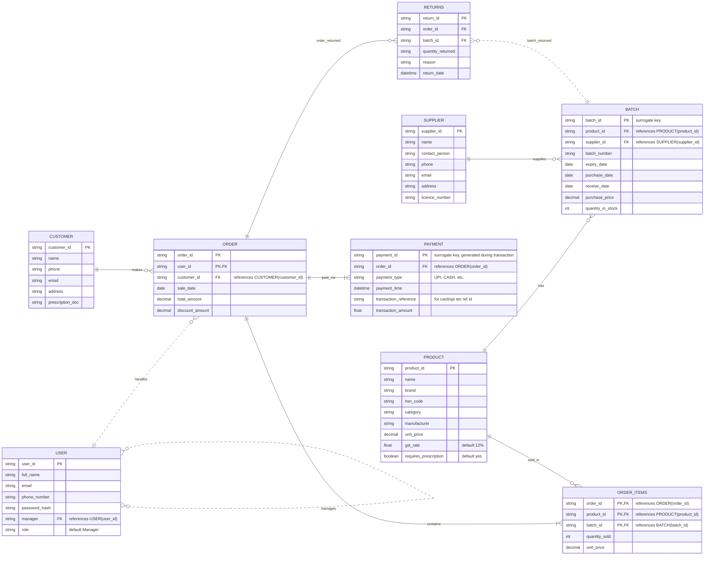

```mermaid
erDiagram
    direction TB
    direction LR
    USER {
    string user_id PK
    string full_name
    string email
    string phone_number
    string password_hash
    string manager FK "references USER(user_id)"
    string role "default Manager"
    }

    PRODUCT {
        string product_id PK
        string name
        string brand
        string hsn_code
        string category
        string manufacturer
        decimal unit_price
        float gst_rate "default 12%"
        boolean requires_prescription "default yes"
    }

    BATCH {
        string batch_id PK		"surrogate key"
        string product_id FK	"references PRODUCT(product_id)"
        string supplier_id FK	"references SUPPLIER(supplier_id)"
        string batch_number
		date expiry_date
        date purchase_date
        date receive_date
        decimal purchase_price
        int quantity_in_stock
    }

	SUPPLIER {
		string supplier_id PK
		string name
		string contact_person
		string phone
		string email
		string address
		string licence_number
	}
	
	CUSTOMER {
		string customer_id PK
		string name
		string phone
		string email
		string address
		string prescription_doc
	}
	
	ORDER {
		string order_id PK
		string user_id PK, FK	
		string customer_id FK	"references CUSTOMER(customer_id)"
		date sale_date
		decimal total_amount
		decimal discount_amount
	}

    ORDER_ITEMS {
        string order_id PK, FK		"references ORDER(order_id)"
        string product_id PK, FK	"references PRODUCT(product_id)"
        string batch_id PK, FK		"references BATCH(batch_id)"
        int quantity_sold
        decimal unit_price
    }

    PAYMENT {
    	string payment_id PK	"surrogate key, generated during transaction"
        string order_id FK		"references ORDER(order_id)"	
        string payment_type 	"UPI, CASH, etc."
        datetime payment_time
        string transaction_reference	"for card/upi etc ref id "
        float transaction_amount
    }
    
    RETURNS {
		string return_id PK
		string order_id FK
		string batch_id FK
		string quantity_returned
		string reason
		datetime return_date
	}

    USER }o..o{ USER : manages
    USER ||..o{ ORDER : handles
    CUSTOMER ||--o{ ORDER : makes
    PRODUCT ||--o{ BATCH : has
    ORDER ||--|{ ORDER_ITEMS : contains
    ORDER ||--|{ PAYMENT : paid_via
    PRODUCT ||--o{ ORDER_ITEMS : sold_in
    SUPPLIER ||--o{ BATCH : supplies
    ORDER ||--o{ RETURNS : order_returned
    RETURNS }o..|| BATCH : batch_returned
```
