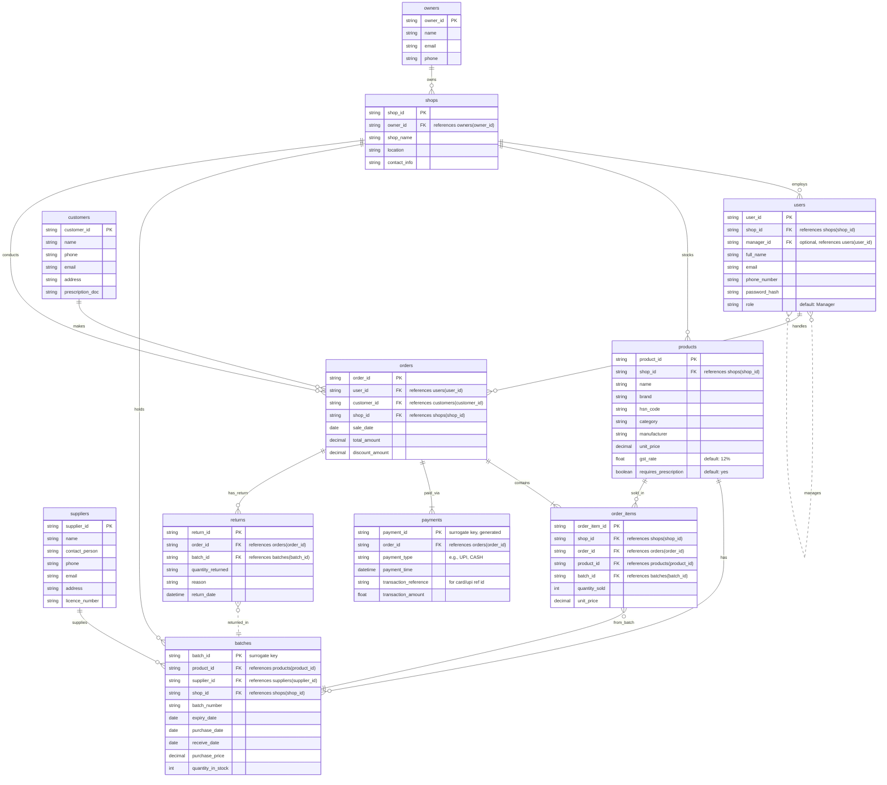

```mermaid
erDiagram
    owners {
    string owner_id PK
    string name
    string email
    string phone
}

shops {
    string shop_id PK
    string owner_id FK "references owners(owner_id)"
    string shop_name
    string location
    string contact_info
}

users {
    string user_id PK
    string shop_id FK "references shops(shop_id)"
    string manager_id FK "optional, references users(user_id)"
    string full_name
    string email
    string phone_number
    string password_hash
    string role "default: Manager"
}

products {
    string product_id PK
    string shop_id FK "references shops(shop_id)"
    string name
    string brand
    string hsn_code
    string category
    string manufacturer
    decimal unit_price
    float gst_rate "default: 12%"
    boolean requires_prescription "default: yes"
}

batches {
    string batch_id PK "surrogate key"
    string product_id FK "references products(product_id)"
    string supplier_id FK "references suppliers(supplier_id)"
    string shop_id FK "references shops(shop_id)"
    string batch_number
    date expiry_date
    date purchase_date
    date receive_date
    decimal purchase_price
    int quantity_in_stock
}

suppliers {
	string supplier_id PK
	string name
	string contact_person
	string phone
	string email
	string address
	string licence_number
}

customers {
	string customer_id PK
	string name
	string phone
	string email
	string address
	string prescription_doc
}

orders {
	string order_id PK
	string user_id FK "references users(user_id)"
	string customer_id FK "references customers(customer_id)"
	string shop_id FK "references shops(shop_id)"
    date sale_date
	decimal total_amount
	decimal discount_amount
}

order_items {
    string order_item_id PK
    string shop_id FK "references shops(shop_id)"
    string order_id FK "references orders(order_id)"
    string product_id FK "references products(product_id)"
    string batch_id FK "references batches(batch_id)"
    int quantity_sold
    decimal unit_price
}

payments {
    string payment_id PK "surrogate key, generated"
    string order_id FK "references orders(order_id)"
    string payment_type "e.g., UPI, CASH"
    datetime payment_time
    string transaction_reference "for card/upi ref id"
    float transaction_amount
}

returns {
	string return_id PK
	string order_id FK "references orders(order_id)"
	string batch_id FK "references batches(batch_id)"
	string quantity_returned
	string reason
	datetime return_date
}

owners ||--o{ shops : owns
shops ||--o{ users : employs
shops ||--o{ products : stocks
shops ||--o{ batches : holds
shops ||--o{ orders : conducts
users }o..o{ users : manages
users ||--o{ orders : handles
customers ||--o{ orders : makes
products ||--o{ batches : has
orders ||--|{ order_items : contains
orders ||--|{ payments : paid_via
products ||--o{ order_items : sold_in
order_items }o--|| batches : from_batch
suppliers ||--o{ batches : supplies
orders ||--o{ returns : has_return
returns }o..|| batches : returned_in
```
