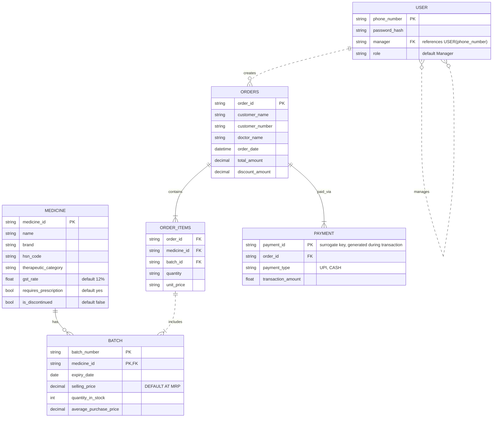

```mermaid
erDiagram
    USER {
    string phone_number PK
    string password_hash
    string manager FK "references USER(phone_number)"
    string role "default Manager"
    }

    MEDICINE {
        string medicine_id PK
        string name
        string brand
        string hsn_code
        string therapeutic_category
        float gst_rate "default 12%"
        bool requires_prescription "default yes"
        bool is_discontinued "default false"
    }

    BATCH {
        string batch_number PK
        string medicine_id PK,FK
        date expiry_date
        decimal selling_price "DEFAULT AT MRP"
        int quantity_in_stock
        decimal average_purchase_price
    }

    ORDERS {
        string order_id PK
        string customer_name
        string customer_number
        string doctor_name
        datetime order_date
        decimal total_amount
        decimal discount_amount
    }

    ORDER_ITEMS {
        string order_id FK
        string medicine_id FK
        string batch_id FK
        string quantity
        string unit_price
    }

    PAYMENT {
        string payment_id PK	"surrogate key, generated during transaction"
        string order_id FK
        string payment_type "UPI, CASH"
        float transaction_amount
    }

    USER }o..o{ USER : manages
    USER ||..o{ ORDERS : creates
    MEDICINE ||--o{ BATCH : has
    ORDERS ||--|{ ORDER_ITEMS : contains
    ORDERS ||--|{ PAYMENT : paid_via
    ORDER_ITEMS ||..|{ BATCH : includes
```
