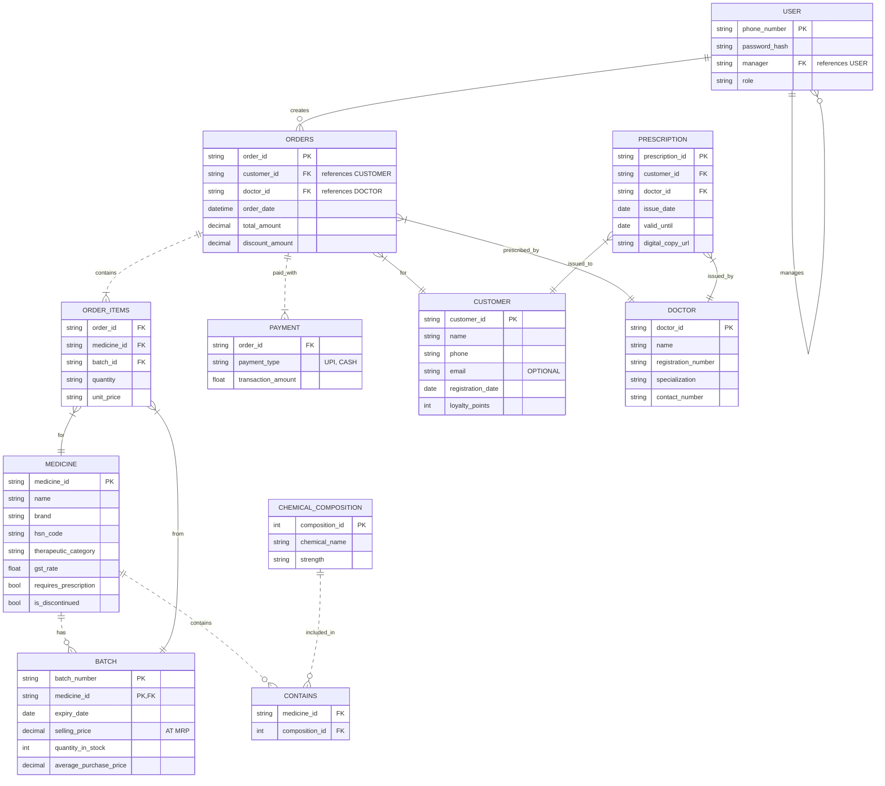

```mermaid
erDiagram
    USER {
        string phone_number PK
        string password_hash
        string manager FK "references USER"
        string role
    }

    MEDICINE {
        string medicine_id PK
        string name
        string brand
        string hsn_code
        string therapeutic_category
        float gst_rate
        bool requires_prescription
        bool is_discontinued
    }

    CHEMICAL_COMPOSITION {
        int composition_id PK
        string chemical_name
        string strength
    }

    CONTAINS {
        string medicine_id FK
        int composition_id FK
    }

    BATCH {
        string batch_number PK
        string medicine_id PK,FK
        date expiry_date
        decimal selling_price "AT MRP"
        int quantity_in_stock
        decimal average_purchase_price
    }

    ORDERS {
        string order_id PK
        string customer_id FK "references CUSTOMER"
        string doctor_id FK "references DOCTOR"
        datetime order_date
        decimal total_amount
        decimal discount_amount
    }

    ORDER_ITEMS {
        string order_id FK
        string medicine_id FK
        string batch_id FK
        string quantity
        string unit_price
    }

    PAYMENT {
        string order_id FK
        string payment_type "UPI, CASH"
        float transaction_amount
    }

    CUSTOMER {
        string customer_id PK
        string name
        string phone
        string email    "OPTIONAL"
        date registration_date
        int loyalty_points
    }

    DOCTOR {
        string doctor_id PK
        string name
        string registration_number
        string specialization
        string contact_number
    }

    PRESCRIPTION {
        string prescription_id PK
        string customer_id FK
        string doctor_id FK
        date issue_date
        date valid_until
        string digital_copy_url
    }

    %% RELATIONSHIPS

    USER ||--o{ USER : manages
    USER ||--o{ ORDERS : creates

    MEDICINE ||..o{ BATCH : has
    MEDICINE ||..o{ CONTAINS : contains
    CHEMICAL_COMPOSITION ||..o{ CONTAINS : included_in

    ORDERS ||..|{ ORDER_ITEMS : contains
    ORDERS ||..|{ PAYMENT : paid_with
    ORDERS }|--|| CUSTOMER : for
    ORDERS }|--|| DOCTOR : prescribed_by

    ORDER_ITEMS }|--|| BATCH : from
    ORDER_ITEMS }|--|| MEDICINE : for

    PRESCRIPTION }|--|| CUSTOMER : issued_to
    PRESCRIPTION }|--|| DOCTOR : issued_by
```
